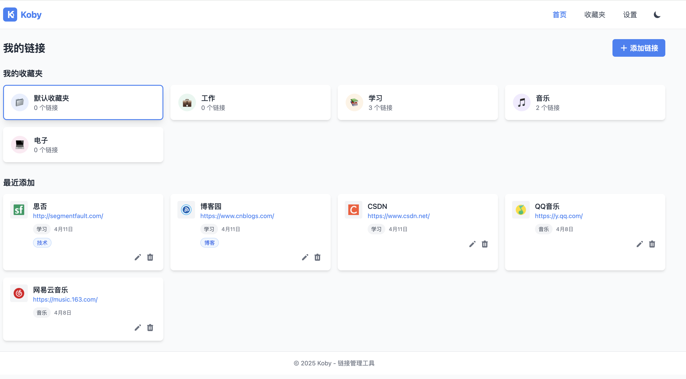
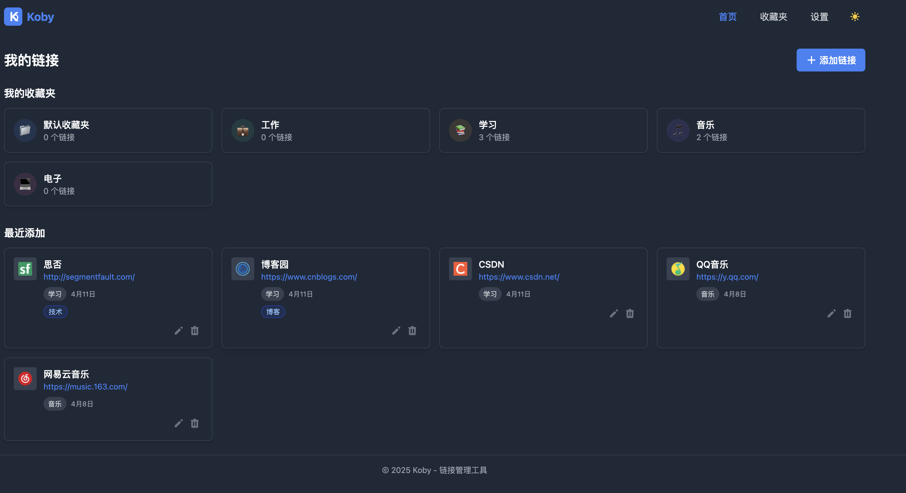
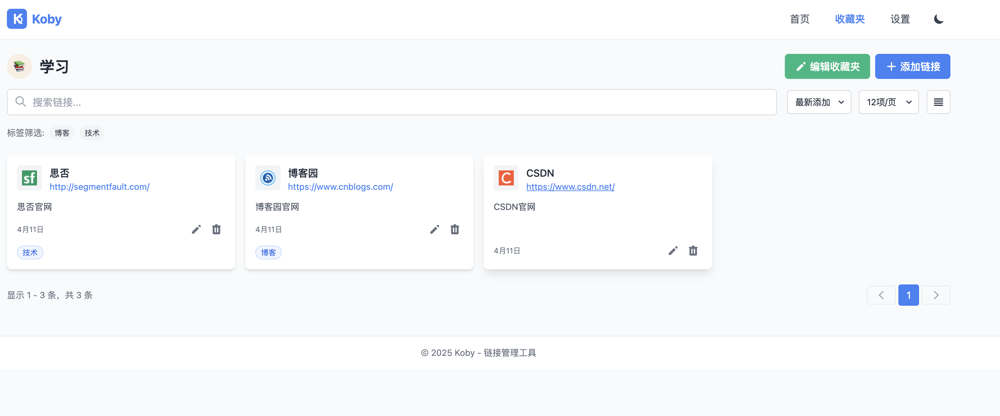
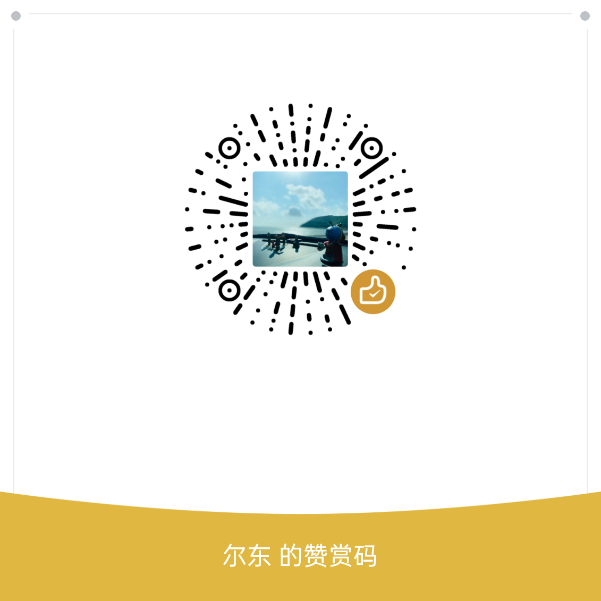

# Koby - 链接管理工具

<p align="center">
  
</p>

Koby 是一个简洁高效的多用户链接管理工具，帮助您整理、分类和快速访问重要网页链接。支持用户注册登录、邮箱验证、收藏夹管理、标签系统、暗色主题等功能，数据存储在 Cloudflare D1 上，部署在 Vercel。

## 功能特点

- **用户认证**：邮箱注册/登录，JWT 认证，邮箱验证，多用户数据隔离
- **收藏夹管理**：侧边栏+书签列表布局，自定义 emoji 图标和颜色
- **链接管理**：添加、编辑、删除、搜索、置顶，自动获取 Favicon
- **标签系统**：为链接添加标签，支持按标签筛选
- **视图切换**：网格视图 / 列表视图，可配置分页
- **暗色/亮色主题**：支持自动跟随系统或手动切换
- **数据导入导出**：支持 JSON 和浏览器 HTML 书签格式
- **响应式设计**：桌面端侧边栏布局，移动端自动折叠为下拉选择器
- **安全防护**：请求频率限制、输入校验、XSS 防护、邮箱标准化

## 快速开始

### 环境要求

- Node.js >= 18
- Cloudflare D1 数据库
- SMTP 邮件服务（用于注册验证）

### 安装

```bash
git clone <repo-url>
cd koby
npm install
```

### 配置

```bash
cp .env.example .env
```

编辑 `.env` 文件，填入实际配置：

| 变量 | 说明 |
|------|------|
| `CF_ACCOUNT_ID` | Cloudflare 账户 ID |
| `CF_D1_DATABASE_ID` | D1 数据库 ID |
| `CF_API_TOKEN` | Cloudflare API Token |
| `JWT_SECRET` | JWT 签名密钥（随机字符串） |
| `CLIENT_URL` | 前端地址（CORS + 验证邮件链接） |
| `SMTP_HOST` / `SMTP_PORT` / `SMTP_USER` / `SMTP_PASS` | SMTP 邮件服务 |
| `SMTP_FROM` | 发件人（需与 SMTP_USER 一致） |
| `VITE_API_URL` | 后端 API 地址（Vercel 部署时留空） |

### 初始化数据库

在 Cloudflare D1 控制台执行 `db/init-d1.sql` 中的建表语句。

### 本地开发

```bash
# 同时启动前端和后端
npm run dev:all

# 或分别启动
npm run dev      # 前端 (http://localhost:5173)
npm run server   # 后端 (http://localhost:3001)
```

### 构建部署

```bash
npm run build
```

Vercel 部署时在项目设置中配置环境变量，`VITE_API_URL` 留空，`CLIENT_URL` 设为实际域名。

## 技术栈

### 前端
- **框架**：Vue 3 (Composition API)
- **状态管理**：Pinia
- **路由**：Vue Router（含 Auth Guard）
- **样式**：Tailwind CSS
- **构建**：Vite
- **HTTP**：Axios（自动注入 Token、401 拦截）

### 后端
- **服务器**：Node.js + Express
- **数据库**：Cloudflare D1 (SQLite)
- **认证**：JWT + bcryptjs
- **邮件**：nodemailer
- **安全**：express-rate-limit

### 部署
- **前端 + API**：Vercel (Serverless Functions)
- **数据库**：Cloudflare D1

## 项目结构

```
koby/
├── api/index.js              # Vercel Serverless 入口
├── db/init-d1.sql            # D1 数据库 Schema
├── server.js                 # 本地开发服务器
├── server/
│   ├── db/database.js        # D1 数据库适配层
│   ├── middleware/auth.js     # JWT 认证中间件
│   ├── routes/
│   │   ├── auth.js           # 认证路由（注册/登录/验证）
│   │   ├── bookmarks.js      # 书签路由
│   │   └── collections.js    # 收藏夹路由
│   └── utils/
│       ├── bookmarkParser.js # HTML 书签解析
│       ├── email.js          # 邮件发送
│       └── favicon.js        # Favicon 获取
├── src/
│   ├── App.vue               # 根组件
│   ├── router/index.js       # 前端路由 + Auth Guard
│   ├── services/api.js       # API 服务层
│   ├── stores/
│   │   ├── auth.js           # 认证状态
│   │   ├── bookmarks.js      # 书签/收藏夹状态
│   │   └── theme.js          # 主题状态
│   ├── views/
│   │   ├── HomeView.vue      # 首页
│   │   ├── CollectionsView.vue # 收藏夹（侧边栏+书签列表）
│   │   ├── LoginView.vue     # 登录/注册
│   │   ├── VerifyEmailView.vue # 邮箱验证
│   │   └── SettingsView.vue  # 设置
│   └── components/           # 通用组件
└── vercel.json               # Vercel 部署配置
```

## API 接口

### 认证（无需 Token，有频率限制）

| 方法 | 路径 | 说明 |
|------|------|------|
| POST | `/api/auth/register` | 注册 |
| POST | `/api/auth/login` | 登录 |
| POST | `/api/auth/verify-email` | 验证邮箱 |
| POST | `/api/auth/resend-verification` | 重发验证邮件 |
| GET | `/api/auth/me` | 获取当前用户（需 Token） |

### 书签（需 Token）

| 方法 | 路径 | 说明 |
|------|------|------|
| GET | `/api/bookmarks` | 获取所有书签 |
| GET | `/api/bookmarks/collection/:id` | 获取收藏夹下的书签 |
| POST | `/api/bookmarks` | 添加书签 |
| PUT | `/api/bookmarks/:id` | 更新书签 |
| DELETE | `/api/bookmarks/:id` | 删除书签 |
| POST | `/api/bookmarks/parse-html` | 解析 HTML 书签文件 |

### 收藏夹（需 Token）

| 方法 | 路径 | 说明 |
|------|------|------|
| GET | `/api/collections` | 获取所有收藏夹 |
| GET | `/api/collections/:id` | 获取单个收藏夹 |
| POST | `/api/collections` | 添加收藏夹 |
| PUT | `/api/collections/:id` | 更新收藏夹 |
| DELETE | `/api/collections/:id` | 删除收藏夹 |

## 应用截图

<details>
  <summary><b>亮色模式</b></summary>
  
</details>
<details>
  <summary><b>暗色模式</b></summary>
  
</details>
<details>
  <summary><b>收藏夹页面</b></summary>
  
</details>

## 许可证

[MIT](LICENSE)

## 赞赏支持

如果您觉得 Koby 对您有所帮助，欢迎扫描下方二维码进行赞赏：

<p align="center">
  
</p>

---

使用 [Trae](https://www.trae.ai/) 构建
