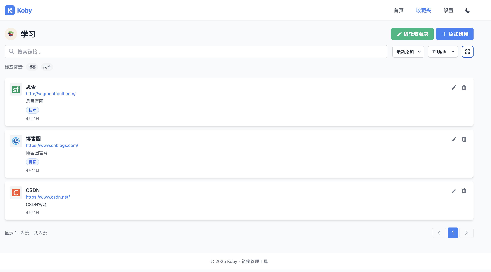
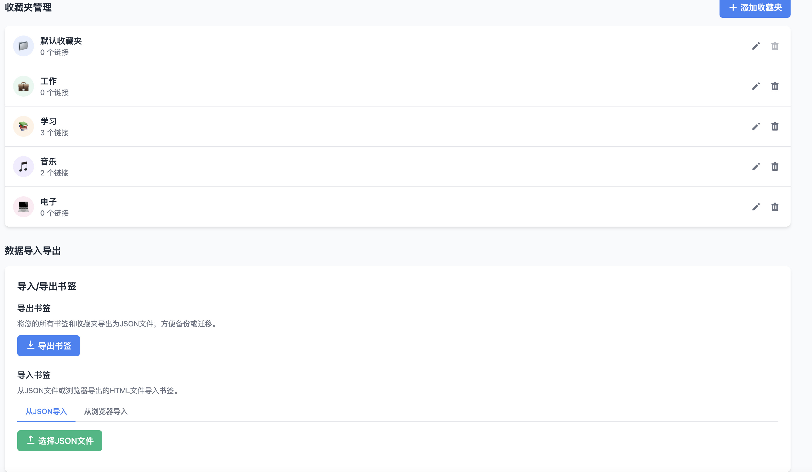

# Koby - 链接管理工具

<p align="center">
  
</p>

Koby是一个简洁高效的链接管理工具，帮助您整理、分类和快速访问重要网页链接。无论是工作资料、学习资源还是个人收藏，Koby都能让您的网络书签井然有序。现在支持MySQL数据库存储，提供更可靠的数据管理能力，并增加了暗色主题、标签系统等多项实用功能。

## ✨ 功能特点

- **链接管理**：添加、编辑、删除和搜索您的网页链接
- **收藏夹分类**：创建自定义收藏夹，使用emoji图标和颜色进行个性化设置
- **标签系统**：为链接添加标签，支持按标签筛选和分类
- **暗色/亮色主题**：支持自动跟随系统设置或手动切换的主题模式
- **视图切换**：支持网格视图和列表视图，满足不同浏览习惯
- **分页功能**：大量链接时自动分页，提升浏览体验
- **快速访问**：首页展示最近添加的链接和收藏夹快捷入口
- **数据库存储**：所有数据安全存储在MySQL数据库中，提供可靠的数据持久化
- **数据导入导出**：支持数据备份和恢复功能
- **响应式设计**：完美适配桌面、平板和移动设备的各种屏幕尺寸
- **API接口**：提供RESTful API接口，支持前后端分离

## 🚀 快速开始

### 环境准备

1. 确保已安装Node.js (v18+)和MySQL
2. 克隆仓库到本地
3. 复制环境变量配置文件

```bash
cp .env.example .env
```

4. 编辑.env文件，配置数据库连接信息

### 数据库设置

1. 创建MySQL数据库

```bash
mysql -u root -p < db/init.sql
```

或手动执行init.sql中的SQL语句创建数据库和表

### 安装依赖

```bash
npm install
```

### 开发环境运行

同时启动前端和后端服务：

```bash
npm run dev:all
```

或分别启动：

```bash
# 前端服务
npm run dev

# 后端API服务
npm run server
```

### 构建生产版本

```bash
npm run build
```

### 预览生产构建

```bash
npm run preview
```

## 💻 技术栈

### 前端
- **框架**：Vue 3 (Composition API)
- **状态管理**：Pinia
- **路由管理**：Vue Router
- **UI 框架**：Tailwind CSS
- **构建工具**：Vite
- **HTTP客户端**：Axios
- **工具库**：@vueuse/core (用于主题检测等功能)

### 后端
- **服务器**：Node.js + Express
- **数据库**：MySQL
- **ORM**：mysql2
- **环境变量**：dotenv

## 📱 应用截图

<details>
  <summary><b>亮色模式</b></summary>
  
</details>
<details>
  <summary><b>暗色模式</b></summary>
  
</details>
<details>
  <summary><b>收藏夹表格页面</b></summary>
  
</details>
<details>
  <summary><b>收藏夹列表页面</b></summary>
  
</details>
<details>
  <summary><b>设置页面</b></summary>
  
</details>

## 🔧 主要功能说明

### 链接管理

- 添加新链接：输入URL、标题、描述和标签
- 编辑现有链接：修改链接信息、所属收藏夹或标签
- 删除链接：移除不再需要的书签
- 搜索功能：快速查找特定链接

### 收藏夹管理

- 创建自定义收藏夹：设置名称、图标和颜色
- 编辑收藏夹：修改收藏夹属性
- 删除收藏夹：移除不需要的分类（链接会自动移至默认收藏夹）

### 标签系统

- 添加标签：为链接添加多个标签
- 标签筛选：通过标签快速筛选相关链接

### 主题切换

- 自动主题：根据系统设置自动切换亮色/暗色主题
- 手动切换：通过界面按钮手动切换主题
- 主题持久化：记住用户的主题偏好设置

### 视图模式

- 网格视图：以卡片形式展示链接，适合视觉浏览
- 列表视图：以列表形式展示链接，适合快速查找

### 分页功能

- 自动分页：大量链接时自动分页显示
- 页码导航：直观的页码导航和前后页切换

### 数据导入导出

- 导出数据：将所有链接和收藏夹导出为JSON文件
- 导入数据：从备份文件中恢复数据

### API接口

- 书签API：提供书签的CRUD操作，支持标签和分页
- 收藏夹API：提供收藏夹的CRUD操作

## 🛠️ 环境变量配置

项目使用.env文件进行环境配置，主要包含以下变量：

```
# 服务器配置
PORT=3001                        # 后端服务器端口
CLIENT_URL=http://localhost:3000 # 前端应用URL

# 数据库配置
DB_HOST=127.0.0.1               # 数据库主机
DB_USER=root                     # 数据库用户名
DB_PASSWORD=your_password        # 数据库密码
DB_NAME=koby                     # 数据库名称

# 前端API配置
VITE_API_URL=http://localhost:3001 # 后端API地址
```

## 📄 许可证

[MIT](LICENSE)

## 🤝 贡献指南

欢迎提交问题和功能请求！如果您想为Koby做出贡献，请随时提交Pull Request。

## 💰 赞赏支持

如果您觉得Koby对您有所帮助，欢迎扫描下方二维码进行赞赏，您的支持是我们持续改进的动力！

<p align="center">
  
</p>

<p align="center">感谢您的每一份支持与鼓励 ❤️</p>

---

使用 ❤️ [Trae](https://www.trae.ai/) 构建