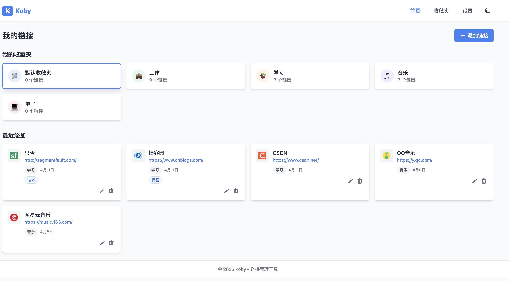
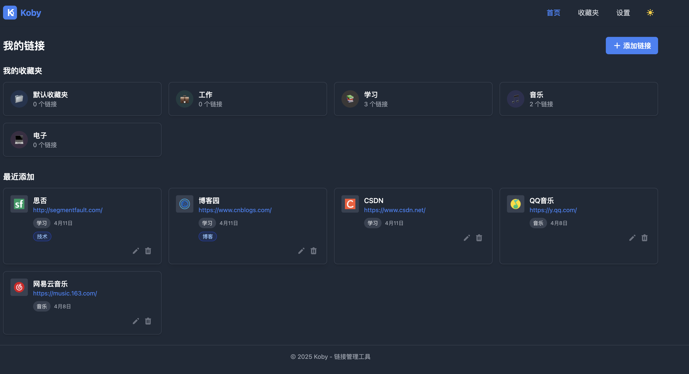
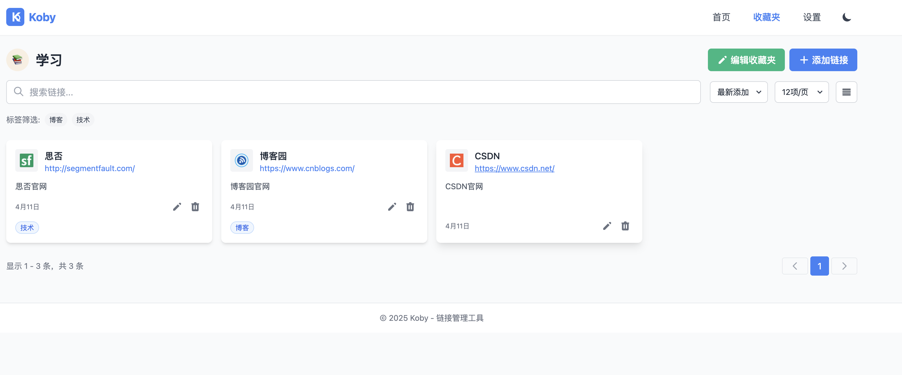
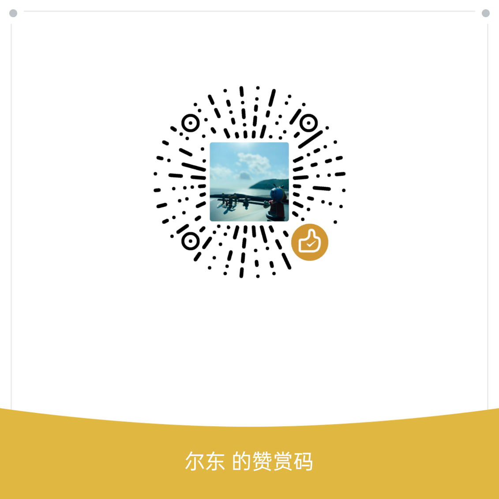

# Koby

<p align="center">
  
</p>

<p align="center">
  <strong>自托管书签管理器，内置开发者工具箱</strong>
</p>

<p align="center">
  <a href="./README.md">English</a>
</p>

---

Koby 是一个简洁高效的自托管书签管理器，适合个人和小团队使用。轻松整理、分类和快速访问您的网页书签。内置 21 个开发者常用小工具，全部在浏览器本地运行，数据不会离开您的设备。

## 功能特点

### 书签管理
- **收藏夹** — 树形嵌套结构，自定义 emoji 图标和颜色
- **标签系统** — `#tag` 风格标签，支持按标签筛选
- **全局搜索** — `Ctrl+K` / `Cmd+K` 快捷键，客户端即时搜索 + 后端搜索
- **URL 重复检测** — 新增书签时自动检测已存在的 URL
- **置顶与分享** — 置顶重要书签，一键复制标题 + 链接
- **数据导入导出** — 支持 JSON 和浏览器 HTML 书签格式
- **视图切换** — 网格 / 列表视图，无限滚动懒加载

### 开发者工具箱（21 个工具）

所有工具完全在浏览器本地运行，无需发送任何服务器请求。

| 工具 | 说明 |
| ---- | ---- |
| JSON 格式化 | 格式化、压缩和校验 JSON 数据 |
| Base64 编解码 | Base64 编码与解码转换 |
| URL 编解码 | URL 编码与解码转换 |
| 时间戳转换 | Unix 时间戳与日期互转 |
| UUID 生成器 | 批量生成随机 UUID |
| 颜色转换 | HEX、RGB、HSL 颜色格式互转 |
| 字数统计 | 统计字符数、单词数、行数 |
| Hash 生成 | SHA-1/256/384/512 哈希计算 |
| 正则测试 | 在线测试正则表达式匹配 |
| 文本对比 | 逐行对比两段文本的差异 |
| 日期计算器 | 计算日期差值，推算未来/过去日期 |
| SQL 格式化 | SQL 语句美化与压缩 |
| 代码美化 | 代码语法高亮着色，导出分享图片 |
| Lorem Ipsum | 生成占位假文本段落 |
| JWT 解码 | 解码 JWT Token，查看 Header/Payload，检查过期状态 |
| Properties ↔ YAML | Properties 与 YAML 格式互转 |
| Cron 表达式 | 解析 Cron 表达式，人类可读描述 + 接下来 5 次执行时间 |
| HTTP 状态码 | 可搜索的 HTTP 状态码速查表 |
| 进制转换 | BIN/OCT/DEC/HEX 实时互转 |
| Markdown 预览 | 左右分栏实时 Markdown 编辑与预览 |
| QR Code 生成 | 输入文本或链接生成二维码，下载 PNG |

### 平台能力
- **用户认证** — 邮箱注册/登录，JWT 认证，邮箱验证，密码找回
- **中英文切换** — 完整双语支持，一键切换
- **暗色/亮色主题** — 自动跟随系统或手动切换
- **浏览器扩展** — 一键保存当前页面，AI 智能标签建议
- **响应式设计** — 桌面端侧边栏，移动端抽屉菜单
- **PWA 支持** — Service Worker 离线缓存，可安装为桌面应用
- **安全防护** — 请求频率限制、输入校验、XSS 防护、邮箱标准化

## 快速开始

### 环境要求

- Node.js >= 18
- Cloudflare D1 数据库
- Resend 邮件服务（用于注册验证）

### 安装

```bash
git clone <repo-url>
cd koby
npm install
```

### 配置

```bash
cp .env.example .env
```

编辑 `.env` 文件，填入实际配置：

| 变量 | 说明 |
| ---- | ---- |
| `CF_ACCOUNT_ID` | Cloudflare 账户 ID |
| `CF_D1_DATABASE_ID` | D1 数据库 ID |
| `CF_API_TOKEN` | Cloudflare API Token |
| `JWT_SECRET` | JWT 签名密钥（随机字符串） |
| `CLIENT_URL` | 前端地址（CORS + 验证邮件链接） |
| `RESEND_API_KEY` | Resend API 密钥 |
| `RESEND_FROM` | 发件人地址（需配置自定义域名） |
| `VITE_API_URL` | 后端 API 地址（Vercel 部署时留空） |

### 初始化数据库

在 Cloudflare D1 控制台执行 `db/init-d1.sql` 中的建表语句。

### 本地开发

```bash
# 同时启动前端和后端
npm run dev:all

# 或分别启动
npm run dev      # 前端 (http://localhost:5173)
npm run server   # 后端 (http://localhost:3001)
```

### 构建部署

```bash
npm run build
```

Vercel 部署时在项目设置中配置环境变量，`VITE_API_URL` 留空，`CLIENT_URL` 设为实际域名。

## 技术栈

**前端**：Vue 3 (Composition API) · Pinia · Vue Router · Tailwind CSS · Vite · Axios

**后端**：Node.js · Express · Cloudflare D1 (SQLite) · JWT · bcryptjs · nanoid · Resend

**部署**：Vercel (Serverless Functions) · Cloudflare D1

## 项目结构

```text
koby/
├── api/index.js              # Vercel Serverless 入口
├── db/init-d1.sql            # D1 数据库 Schema
├── server.js                 # 本地开发服务器
├── browser-extension/        # Chrome 浏览器扩展，一键保存书签
├── server/
│   ├── db/database.js        # D1 数据库适配层
│   ├── middleware/auth.js     # JWT 认证中间件
│   ├── routes/
│   │   ├── auth.js           # 认证路由（注册/登录/验证）
│   │   ├── bookmarks.js      # 书签路由（含搜索）
│   │   └── collections.js    # 收藏夹路由
│   └── utils/
│       ├── bookmarkParser.js # HTML 书签解析
│       ├── email.js          # 邮件发送
│       ├── favicon.js        # Favicon 获取
│       └── id.js             # nanoid 生成唯一 ID
├── src/
│   ├── App.vue               # 根组件（侧边栏 + 顶栏 + 搜索）
│   ├── router/index.js       # 前端路由 + Auth Guard
│   ├── services/api.js       # API 服务层
│   ├── i18n/                 # 国际化翻译（中/英）
│   ├── composables/          # 共享组合式函数（useToolHelper 等）
│   ├── stores/               # Pinia 状态管理（auth, bookmarks, theme, locale, toast）
│   ├── views/
│   │   ├── HomeView.vue      # 首页（置顶书签 + 最近书签）
│   │   ├── CollectionsView.vue # 收藏夹管理 / 收藏夹书签详情
│   │   ├── AllBookmarksView.vue # 全部书签浏览
│   │   ├── ToolboxView.vue   # 开发者工具箱（21 个工具）
│   │   ├── SettingsView.vue  # 设置（导入/导出）
│   │   └── ...               # 登录、验证、密码重置等页面
│   └── components/
│       └── tools/            # 21 个工具组件（ToolJson, ToolJwt 等）
└── vercel.json               # Vercel 部署配置
```

## API 接口

### 认证（无需 Token，有频率限制）

| 方法 | 路径 | 说明 |
| ---- | ---- | ---- |
| POST | `/api/auth/register` | 注册 |
| POST | `/api/auth/login` | 登录 |
| POST | `/api/auth/verify-email` | 验证邮箱 |
| POST | `/api/auth/resend-verification` | 重发验证邮件 |
| POST | `/api/auth/forgot-password` | 发送密码重置邮件 |
| POST | `/api/auth/reset-password` | 重置密码 |
| GET | `/api/auth/me` | 获取当前用户（需 Token） |

### 书签（需 Token）

| 方法 | 路径 | 说明 |
| ---- | ---- | ---- |
| GET | `/api/bookmarks` | 获取所有书签 |
| GET | `/api/bookmarks/search?q=` | 搜索书签 |
| GET | `/api/bookmarks/collection/:id` | 获取收藏夹下的书签 |
| POST | `/api/bookmarks` | 添加书签 |
| PUT | `/api/bookmarks/:id` | 更新书签 |
| DELETE | `/api/bookmarks/:id` | 删除书签 |
| POST | `/api/bookmarks/parse-html` | 解析 HTML 书签文件 |

### 收藏夹（需 Token）

| 方法 | 路径 | 说明 |
| ---- | ---- | ---- |
| GET | `/api/collections` | 获取所有收藏夹 |
| GET | `/api/collections/:id` | 获取单个收藏夹 |
| POST | `/api/collections` | 添加收藏夹 |
| PUT | `/api/collections/:id` | 更新收藏夹 |
| DELETE | `/api/collections/:id` | 删除收藏夹 |

## 应用截图

<details>
  <summary><b>亮色模式</b></summary>
  
</details>
<details>
  <summary><b>暗色模式</b></summary>
  
</details>
<details>
  <summary><b>收藏夹页面</b></summary>
  
</details>

## 许可证

[MIT](LICENSE)

## 赞赏支持

如果您觉得 Koby 对您有所帮助，欢迎扫描下方二维码进行赞赏：

<p align="center">
  
</p>

---

使用 [Trae](https://www.trae.ai/) 构建
